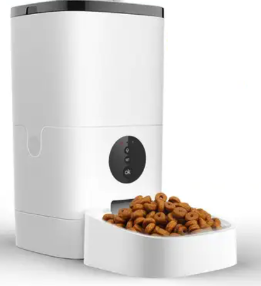

# Pet Feeder External Component for ESPHome

This is an ESPHome external component for controlling an ESP8266-based Wifi pet feeder device via UART to an internal MCU.

> [!IMPORTANT]
> Using this component does require physical modifications to your device that will void your warranty. Those modifications are not detailed in this repo.



## Features
- Feed pet with specified portions
- Track the total portions dispensed
- Automatically indicate network state via device LED

## Installation

In your ESPHome configuration, add:

```yaml
external_components:
  - source: github://jeromelaban/esphome-petfeeder
    components: [petfeeder]
```

## Configuration

```yaml
# Required components
api:

uart:
  rx_pin: GPIO16
  tx_pin: GPIO17
  baud_rate: 9600

petfeeder:
  portions_counter:
    name: "Pet Feeder Portions Counter"
```

## Services

### `petfeeder.feed_pet`
Feed pet with specified portions.

Parameters:
- `portions`: Number of portions to dispense (integer)

Example service call:
```yaml
service:
  - service: petfeeder.feed_pet
    data:
      portions: 2
```

### `petfeeder.test_message`
Send a test message to the device (for debugging).

Parameters:
- `target`: Target address (integer)
- `source`: Source address (integer)
- `command`: Command value (integer)
- `value`: Value to send (integer)
